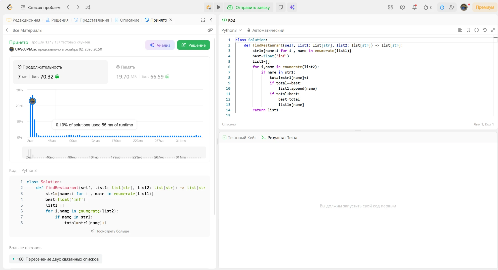

# 599. Minimum Index Sum of Two Lists

🟢 Easy · [Задача на LeetCode](https://leetcode.com/problems/minimum-index-sum-of-two-lists/)

## Условие

Даны два списка строк `list1` и `list2`. Общая строка встречается в обоих списках. Нужно найти все общие строки с минимальной суммой индексов `i + j`, где `list1[i] == list2[j]`. Если таких строк несколько, вернуть их все.

## Идея решения

1. Строим словарь `название → индекс` для `list1`, чтобы искать индекс за O(1).
2. Проходим по `list2`. Для каждой строки, которая есть в словаре, считаем сумму индексов.
3. Если сумма меньше лучшей, начинаем ответ заново с этой строки. Если равна лучшей, добавляем строку в ответ.

## Сложность

- **Время:** O(n + m), где n и m — длины списков.
- **Память:** O(n) на словарь.

## Решение

[solution.py](solution.py) · [тесты](test_solution.py)

