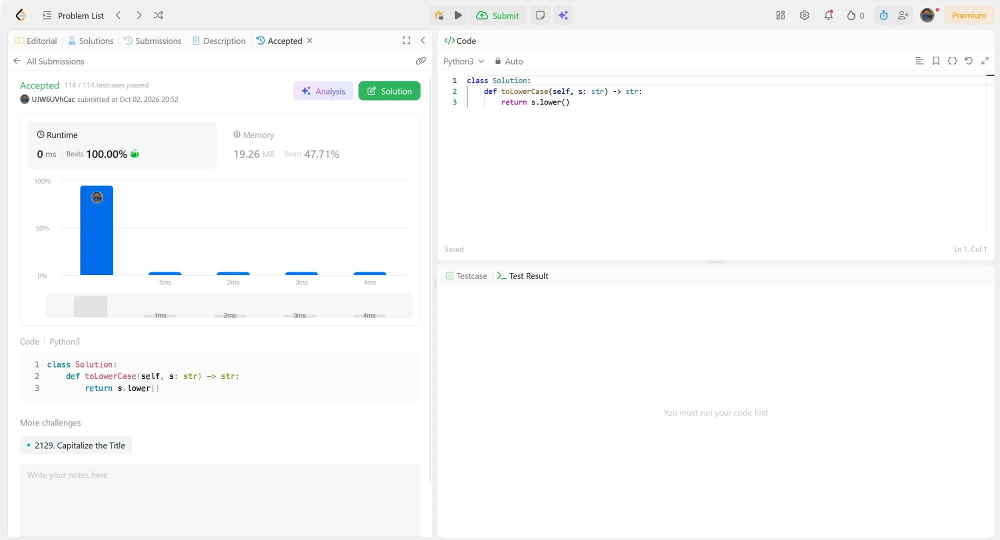

# 709. To Lower Case

🟢 Easy · [Задача на LeetCode](https://leetcode.com/problems/to-lower-case/)

## Условие

Дана строка `s`. Нужно вернуть строку, в которой каждая заглавная буква заменена на такую же строчную.

## Идея решения

Встроенный метод `str.lower()` делает ровно это: проходит по строке и переводит заглавные буквы в строчные. Остальные символы не меняются.

## Сложность

- **Время:** O(n), где n — длина строки.
- **Память:** O(n) на новую строку (строки в Python неизменяемые).

## Решение

[solution.py](solution.py) · [тесты](test_solution.py)

