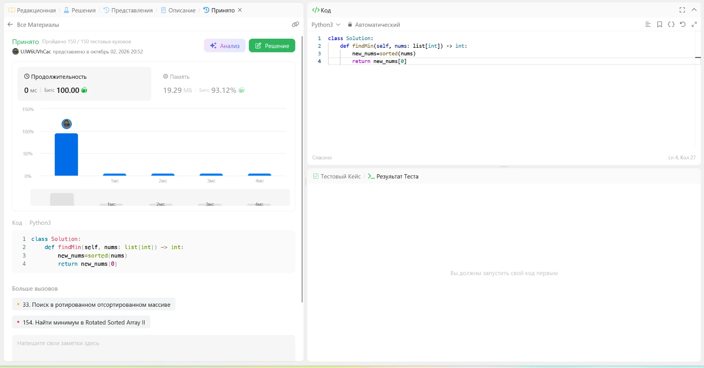

# 153. Find Minimum in Rotated Sorted Array

🟠 Medium · [Задача на LeetCode](https://leetcode.com/problems/find-minimum-in-rotated-sorted-array/)

## Условие

Массив из `n` различных чисел был отсортирован по возрастанию, а потом повёрнут от 1 до `n` раз. Например, `[0,1,2,4,5,6,7]` может стать `[4,5,6,7,0,1,2]`. Нужно найти минимальный элемент.

## Идея решения

Сортируем копию массива через `sorted()` и берём первый элемент. Это и есть минимум.

## Сложность

- **Время:** O(n log n) на сортировку.
- **Память:** O(n) на отсортированную копию.

## Решение

[solution.py](solution.py) · [тесты](test_solution.py)

